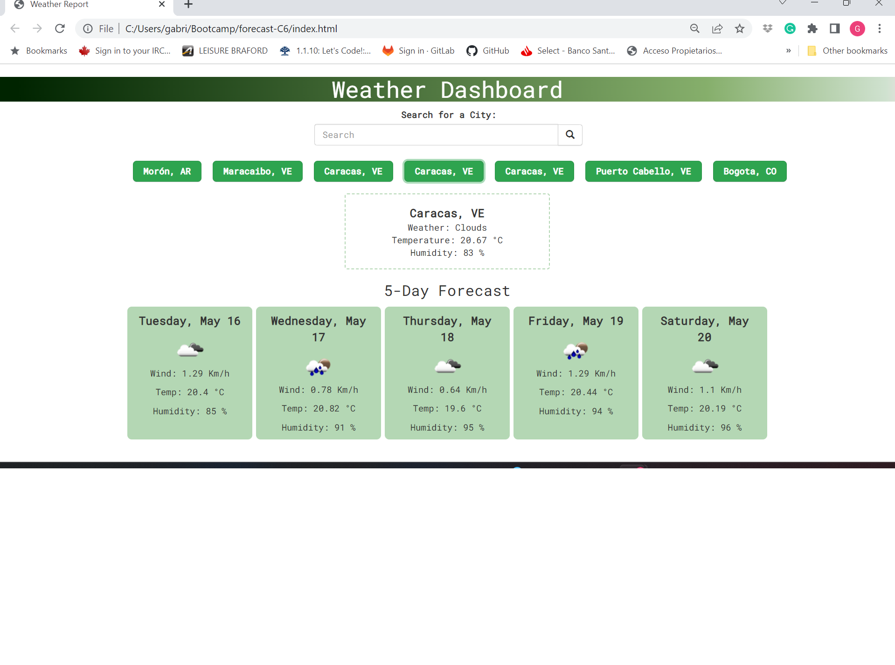

# Weather forecast

# Description
This is a weather app that allows users to search for a city and get the current weather and a 5-day forecast for that city. The app uses the OpenWeatherMap API to fetch weather data.

# Functionalities
-Search for a city and get the current weather and a 5-day forecast
-Save search history in local storage and display it on the page (the app shows the eight last)
-Display weather information in metric unit

# Tools used
-Google Font
-Bootstrap
-Jquery
-https://getcssscan.com/css-buttons-examples
-https://cssgradient.io/ 

# Getting Started
To use the app, simply open the website https://gabrielparada05.github.io/forecast-C6/. A screenshot of the app is available in 

# Usage
To search for a city, type the name of the city in the search bar and press the "Search" button. The app will display the current weather and a 5-day forecast for the city. The search history will be saved in local storage and displayed on the page. Users can collaborate with this project in the GitHub Repo https://github.com/gabrielparada05/forecast-C6.

# Credits
This app was created by Gabriel Parada. It uses the OpenWeatherMap API to fetch weather data.

# License
This project is licensed under the MIT License.

